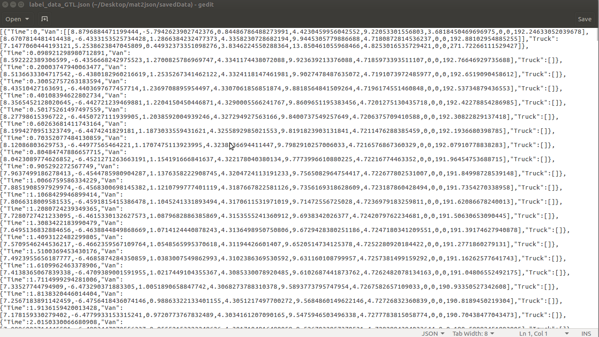
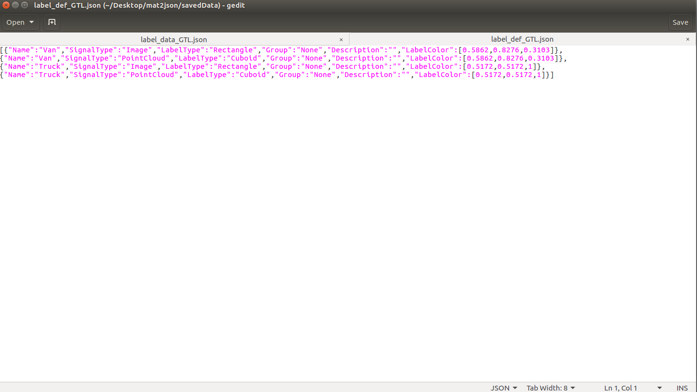
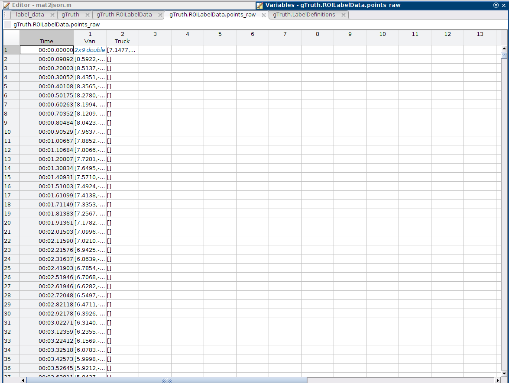
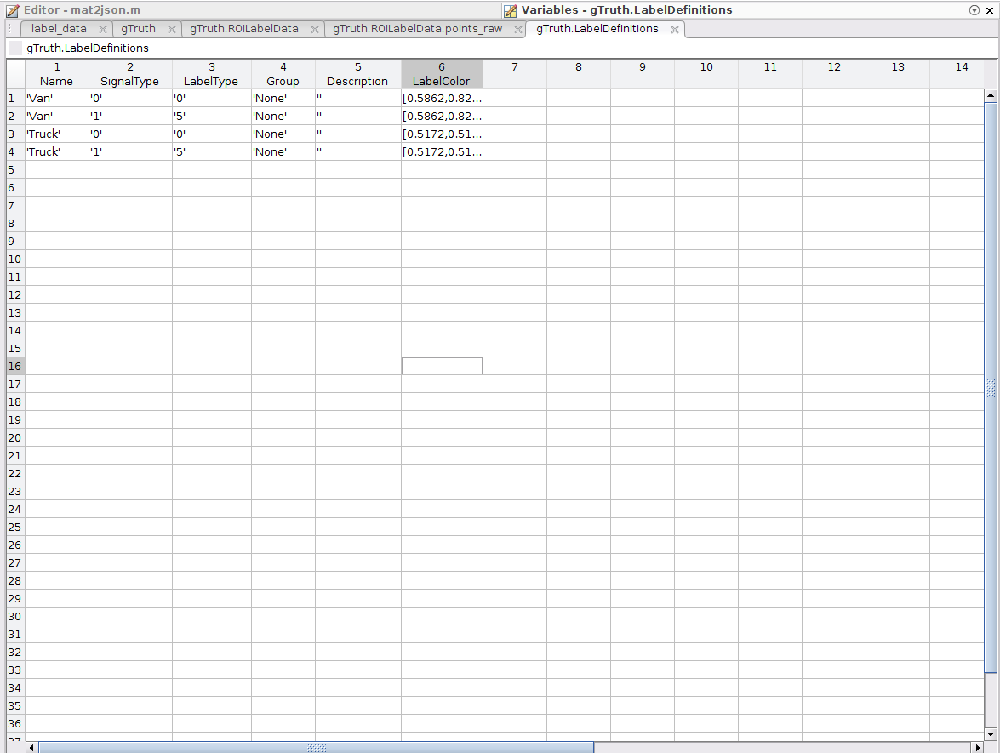

# mat2json for MATLAB Ground Truth Labeler App
This repository is a mat2json conversion tool to convert the exported .mat file from the MATLAB's Ground Truth Labeler App to .json file.

Json Label Data            |  Json Label Definition
:-------------------------:|:-------------------------:
   |  

Mat Label Data            |  Mat Label Definition
:-------------------------:|:-------------------------:
   |  

## Requirements
1. MATLAB R2022a or newer

## File Structure
Root:
├───GTL_Data
│     ├───groundTruthLabelingSession.mat
│     ├───gTruth_GTL.mat
│     ├───pci_dynamic.mp4
│     └───pci_res.mp4
│     
├───img
│     ├───labelData.png
│     ├───labelData_mat.png
│     ├───labelDef.png
│     └───labelDef_mat.png
│    
├───LL_data
│     └───gTruth_LL.mat
│     
├───rosbag
|
├───savedData
│     ├───label_data_GTL.json
│     └───label_def_GTL.json
│     
├───getTF.m
│     
├───load_rosbag.m
│     
├───mat2json.asv
│     
├───mat2json.m
│     
├───saveAsJson.m
│
└───README.md

## How to Run the Script
1. Export the annotated data as a .mat file from the Ground Truth Labeler App.
2. Save the file to the GTL_Data folder.
3. Open the "mat2json.m".
4. Replace the saved file name in Line 6 in the mat2json.m (i.e., gTruth_struct = load("./GTL_Data/gTruth_GTL.mat");)
5. Run the script.
6. The "label_data" and "label_def" will be saved to the saveData folder as .json files. 
